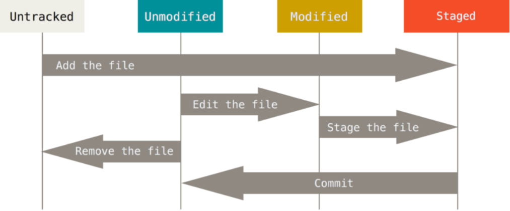

# Git笔记

## Git  配置

- `git config --list` 检查所有配置信息
- `git config <key>` 检查某一项配置

## 获取帮助

- `git help <verb>`
- `git <verb> --help`
- `man git-<verb>`

## 获取Git仓库

- `git init` 在现有项目中初始化仓库
- `git clone [url]` 克隆现有的仓库

## 记录每次更新到仓库

文件四种状态

- `git status` 检查当前文件状态

- `git add` 跟踪新文件

- `git status -s` 

  A 标记：新添加到暂存区中的文件

  M标记：出现在靠左边的M 表示该文件被修改了并放入了暂存区，出现在右边的 M 表示该文件被修改了但是还没放入暂存区

## .gitignore文件规范

- 所有空行或者以 # 开头的行都会被 Git 忽略
- 可以使用标准的 glob 模式匹配
  - 星号(*)匹配零个或多个任意字符
  - [abc] 匹配任何**一个**列在方括号中的字符，-在[]中表示范围
  - 问号(?)只匹配 一个任意字符
  - 两个星号(*) 表示匹配任意中间目录，包括为0个中间目录
- 匹配模式可以以(/)开头防止递归
- 匹配模式可以以(/)结尾指定目录
- 要忽略指定模式以外的文件或目录，可以在模式前加上惊叹号(!)取反

## 查看已暂存和未暂存的修改

- `git diff` 查看修改之后未暂存起来的变化内容
- `git diff --staged(cached)` 查看已暂存的将要添加到下次提交里的内容

## 提交更新

- `git commit` 提交命令
- `git commit -m` 提交以及提交信息
- `git commit -a` 自动把所有已经跟踪过的文件暂存起 来一并提交，跳过`git add`步骤
